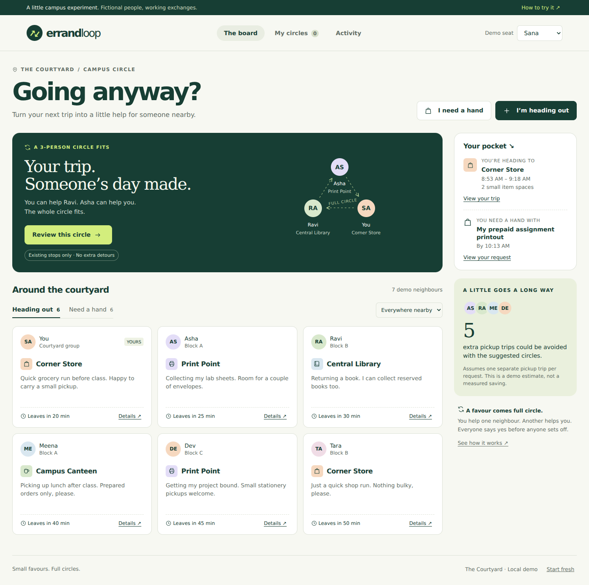

# ErrandLoop

**Going anyway? Turn your next trip into a circle of small favours.**

ErrandLoop is a working, local-first hackathon prototype for a hostel or apartment group. It finds reciprocal exchanges among trips people already intend to make. Asha collects your printout; you collect Ravi's prepared order; Ravi collects Asha's reserved book. Each person helps once and receives help once.



## Run it

Install **Python 3.12**. Download and extract this project first.

**Windows:** double-click `start.bat`. It creates an isolated environment, installs the one runtime dependency, starts the server, and opens the app.

**macOS / Linux / Git Bash:**

```bash
bash start.sh
```

Manual setup (all platforms):

```bash
python -m venv .venv
# Windows: .venv\Scripts\activate
# macOS/Linux: source .venv/bin/activate
python -m pip install -r requirements.txt
python -m app.server --open
```

Open **http://127.0.0.1:8000**. The initial package installation needs internet; normal local use does not. There is no AWS account, card, API key, LLM, map service, or paid API required for the local demo. Data is stored in `errandloop.sqlite3`, outside Git. Use `--port 8001` if port 8000 is occupied.

## Try the full story

1. Start in the **Sana** demo seat (shown as “You” on the board). Your existing grocery trip and printout request are seeded.
2. Select **Review this circle**, inspect the three handovers, then **I'm in — propose this circle**.
3. Use **Continue as Asha** and accept. Repeat as **Ravi**. The circle only activates after all three have accepted.
4. Each collector marks their assigned item collected. Switch to each receiver to confirm receipt. All three confirmations close the circle.
5. Reset the demo. Repeat, but cancel before collection: the remaining posts return to the board. Cancel after collection: goods stay assigned and a handover warning appears.
6. Take **Kabir's** seat to add a new trip and request. Use Central Library for the trip and Corner Store for the request, with compatible times, to create a new exchange opportunity.

All people and pickups are fictional. **Demo seat switching is deliberate simulation, not user authentication.** Do not expose the local server publicly or use it to coordinate real strangers.

## What actually works

- Create and remove trips and prepared pickup requests, with one active post of each kind per person.
- Match exact existing destinations, ready times, return deadlines, and item-space limits.
- Enumerate directed cycles of 2–4 people and select a globally optimal disjoint set for the stated objective on the bounded group.
- Explain unmatched requests; show other feasible cycles as alternatives.
- Reserve a proposed circle atomically, collect individual consent, and expire unaccepted circles.
- Track collector confirmation separately from recipient confirmation.
- Recover from cancellation without silently rematching items already collected.
- Persist the board across reloads, refresh other browser tabs, and reject stale or simultaneous conflicting writes.
- Export an honest activity record; support desktop and mobile layouts with keyboard-accessible dialogs.

The algorithm optimizes **number of requests matched**, then **total scheduled return time**, with stable tie-breaking. It is not a geographic route optimizer. A “potential trip avoided” assumes a separate pickup trip for each matched request; actual savings have not been measured.

## AWS is part of the working implementation

The local app runs the **AWS-originated open-source Cedar policy engine**, through the independently maintained `cedarpy` Python binding. `app/policies.cedar` enforces ownership and participation at every mutation:

- Only a circle participant can accept, decline, or cancel their circle.
- Only the assigned collector can mark an item collected.
- Only the recipient can confirm receipt.
- Only the owner can remove a post.
- Unspecified actions are denied by default.

The matcher proposes possibilities; it cannot impersonate participants or grant consent. AI is not needed to solve this matching problem. The product intentionally avoids unnecessary agent calls and fabricated model outputs.

## Deploy the full app with a URL

The hosted option includes the browser interface, secure demo-code sign-in, Cedar, and DynamoDB. Run the deployment script from an authenticated AWS CloudShell; it verifies the live app before printing its URL. See [the complete deployment steps](docs/DEPLOY-AWS.md). Deployment is prepared and tested locally; no AWS resources have been created by this authoring session.

## Optional AWS cloud backend

`template.yaml` packages the same service for **Lambda + API Gateway + DynamoDB**. The API requires **AWS IAM / SigV4**. It is a restricted hackathon backend, not a finished public multi-user service. The browser app runs against the local Python server; cloud API requests are exercised with the included signed client. No AWS deployment has been performed in this workspace.

With AWS SAM CLI, Docker for the build, an authenticated AWS profile, and permissions to create the resources:

```bash
sam validate --lint
sam build --use-container
sam deploy --guided
```

Install `boto3` for the signed test client, then use the `ApiUrl` output:

```bash
python -m pip install boto3==1.43.96
python scripts/aws_request.py YOUR_API_URL --region ap-south-1
```

The caller needs `execute-api:Invoke` for the deployed API. A successful stack deployment alone does not grant that caller permission. The API's demo actors are selected by an IAM-authorized demonstrator. The template restricts the Lambda role to GetItem/PutItem on its own table. DynamoDB uses consistent reads and conditional writes to reject racing reservations. The small group's state is deliberately one bounded aggregate; migrate to a normalized model before expanding beyond this prototype. Cloud deployment can incur AWS charges. Remove a test stack using `sam delete` when finished.

## Tests

```bash
python -m pip install -r requirements-dev.txt
python -m pytest -q
```

Tests cover constraint violations, exact packing against an independent brute-force oracle, Cedar denials, consent, expiry, cancellation recovery, recipient-only handover confirmation, idempotency, persistence rollback, and simultaneous reservations. Browser QA uses Playwright; see `docs/VALIDATION.md` and `scripts/browser-test.cjs`.

## Project map

```text
app/matching.py        directed-cycle enumeration and disjoint packing
app/service.py         validation and state transitions
app/policies.cedar     enforceable authorization rules
app/auth.py            Cedar engine integration
app/store.py           SQLite transactions / DynamoDB conditional writes
app/server.py          local HTTP server and UI assets
app/lambda_handler.py  IAM-protected Lambda entrypoint
app/static/            original HTML, CSS, and browser interactions
tests/                 meaningful domain and adapter checks
docs/                  architecture, pitch, validation, and screenshots
```

## Originality and scope

Errand sharing, reciprocal exchange, directed graphs, and cycle packing are established concepts. The application source, visual design, and scenario were authored for this project; no existing app repository was copied. The contribution is their specific integration into a small-group workflow with explicit consent, capacity/time constraints, and recoverable handovers. This is not a claim of patent novelty or first-ever invention.

Development was AI-assisted. Review and understand the code and follow the hackathon's disclosure rules. No user interviews, real deployments, or real-world impact numbers are claimed.

Before a real pilot: verify the need with hostel residents, implement authenticated group membership and invitations, arrange legitimate third-party collection permissions, add abuse/reporting controls, and establish practical handover rules. Payments, live location, identity verification, and messaging providers are deliberately outside this demo.

## Credits

- [Cedar policy engine](https://github.com/cedar-policy/cedar), Apache-2.0; [policy reference](https://docs.cedarpolicy.com/policies/syntax-policy.html).
- [cedarpy](https://pypi.org/project/cedarpy/), independently maintained Python binding; retain its bundled notices when redistributing binaries.
- [AWS SAM](https://docs.aws.amazon.com/serverless-application-model/latest/developerguide/what-is-sam.html) and [DynamoDB conditional writes](https://docs.aws.amazon.com/amazondynamodb/latest/developerguide/Expressions.ConditionExpressions.html).
- Python standard library, pytest, boto3, and Playwright for their respective runtime/test roles. Third-party dependencies keep their own licenses; this repository's original source is MIT-licensed.

No third-party photos, stock illustrations, templates, or remote fonts are used.
