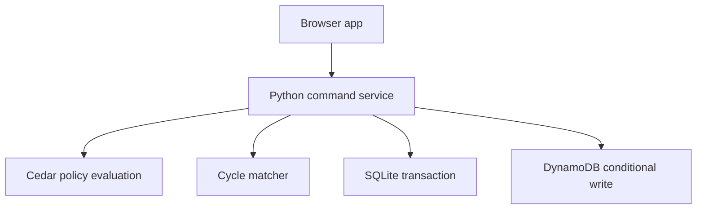
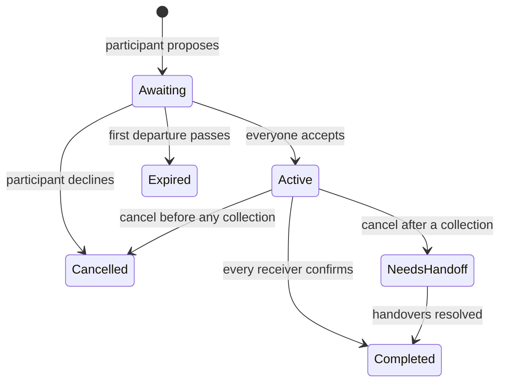

# Live-group update

The default app uses `live.py` and `groups.py`; local groups live in a separate SQLite table and hosted groups use one DynamoDB item per group. Individual salted-scrypt accounts and signed sessions replace demo actor selection. Cedar receives the actual group ID. `live_handler.py` serves the public AWS app. The design below documents the original matcher and demonstration mode; sample data is now available only with `--demo`.

# Architecture and invariants

The browser sends commands to one Python service. The service validates inputs, evaluates Cedar policy using server-owned relationships, changes state inside a transaction, and returns a fresh view. The matcher only reads state.

## Matching

Each participant has at most one open trip and one open request. A directed edge A → B exists only when A's trip matches B's pickup location exactly, A leaves after the item is ready, A returns before B's deadline, and the item fits A's capacity. A cannot serve their own request. Departed, reserved, expired, and completed posts are excluded.

DFS enumerates simple cycles of length 2–4. Requiring the smallest member ID to start a cycle removes rotational duplicates without collapsing direction. Each cycle is mapped to a participant bitmask. A memoized exact set-packing solver chooses a collection of disjoint cycles, first maximizing requests served, then minimizing scheduled return-time sum, then using stable lexical ordering. The search has exponential worst-case complexity and is explicitly bounded to small groups (at most 16 simultaneous participants with eligible posts; the demo has seven named seats).

The solver's guarantee applies only to enumerated cycles of length 2–4 and the stated constraints. It does not optimize physical routes, cover longer cycles, measure distance, or prove real trips were avoided.

## Circle state

Completed/cancelled/expired records remain in history. Unaccepted proposals expire. Active circles do not silently expire and reopen; that could double-assign an item already being picked up. A cancellation removes the cancelling member's trip. Other still-eligible posts reopen only if nothing has been collected. After a collection, assignment remains intact pending human resolution.

## Important invariants

- A post is reserved in at most one circle.
- A stale board version cannot mutate current state.
- Repeated command IDs for the same participant and command are idempotent within the bounded operation history.
- Everyone's acceptance is needed before any collection.
- Collection and receipt are separate, role-restricted facts.
- Only recipient confirmations complete a circle.
- The proposed match is recomputed on the server, not trusted from client-provided edges.
- Failed mutations roll back as a whole.

SQLite uses `BEGIN IMMEDIATE`. DynamoDB uses a consistent read followed by a revision-guarded conditional PutItem; a racing write fails with a conflict instead of overwriting the winner.

## Authorization versus authentication

Cedar evaluates authorization on every write. The local actor switcher is intentionally not authentication. The local server binds to loopback by default, permits no CORS, and checks write origins. The optional deployed API is IAM-protected, with demo actors selectable by an authenticated AWS demonstrator. Neither mode is a public social platform.

All demo members share the courtyard group; identities are seeded server-side. Real-world operation requires authenticated membership, persistent opaque member IDs, separate groups, invitation authorization, and stronger operational controls. Do not mistake this prototype's role checks for a complete production identity system.

## Data and privacy

No GPS, phone numbers, payment details, or external analytics. No request bodies are logged. Local state stays in a SQLite file; the optional cloud state stays in the provisioned encrypted DynamoDB table. Notes are HTML-escaped, assets are local, and a restrictive content security policy is set by the local server.

The export contains the fictional handover history and no impact claims. A future pilot should define deletion, retention, contact-sharing, and incident handling with participants.
